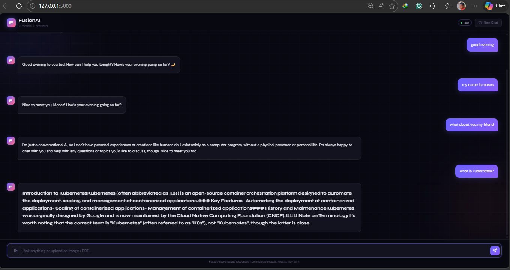

# FusionAI

A multi-model AI fusion system that queries 13 LLMs simultaneously and synthesizes their responses into one superior answer using a hybrid algorithmic and neural fusion pipeline.

## Interface



## How It Works

1. A user prompt is sent to all 13 configured LLMs in parallel using `asyncio` and `aiohttp`
2. Responses are collected with a 15-second hard cap — any model that doesn't respond in time is skipped
3. Responses are scored using ROUGE-L + Weighted Voting + MMR — high-agreement content scores higher, hallucinations and outliers get buried
4. Top-ranked sentences are passed to Groq `llama-3.3-70b-versatile` for final synthesis
5. Groq streams tokens back to the user in real time — first words appear within ~1 second of fusion starting
6. Repeated questions are served instantly from a 24-hour in-memory cache
7. If Groq fusion fails, the algorithmic output is returned directly as fallback

## Models Used

| Provider | Models |
|----------|--------|
| Groq | llama-3.1-8b-instant, llama-3.3-70b-versatile |
| Cerebras | llama3.1-8b |
| Gemini | gemini-2.5-flash |
| SambaNova | Meta-Llama-3.1-8B-Instruct |
| Mistral | mistral-small-latest, open-mistral-7b |
| Nvidia | meta/llama-3.1-8b-instruct, meta/llama-3.1-70b-instruct |
| Cohere | command-a-03-2025 |
| OpenRouter | google/gemma-3-12b-it, google/gemma-3-4b-it, meta-llama/llama-3.1-8b-instruct |

**Fusion model:** Groq `llama-3.3-70b-versatile` (streaming)

## API Keys

Get your free API keys:

| Provider | Link |
|----------|------|
| Groq | https://console.groq.com |
| Cerebras | https://cloud.cerebras.ai |
| Gemini | https://aistudio.google.com |
| SambaNova | https://cloud.sambanova.ai |
| Mistral | https://console.mistral.ai |
| Nvidia | https://build.nvidia.com |
| Cohere | https://dashboard.cohere.com |
| OpenRouter | https://openrouter.ai |

## Configuration

Create a `.env` file in the project root:
```
GROQ_API_KEY=your_groq_key
CEREBRAS_API_KEY=your_cerebras_key
GEMINI_API_KEY=your_gemini_key
SAMBANOVA_API_KEY=your_sambanova_key
MISTRAL_API_KEY=your_mistral_key
NVIDIA_API_KEY=your_nvidia_key
COHERE_API_KEY=your_cohere_key
OPENROUTER_API_KEY=your_openrouter_key
```

## Run with Docker (recommended)

Install Docker: https://www.docker.com/products/docker-desktop
```bash
docker compose up --build
```

Then open **http://localhost:5000** in your browser.

To stop:
```bash
docker compose down
```

## Run Locally

**1. Activate environment:**
```bash
.venv\Scripts\Activate.ps1
```

**2. Install dependencies:**
```bash
pip install -r requirements.txt
```

**3. Test all providers:**
```bash
python test_providers.py
```

Expected output:
```
groq-8b: How can I assist you today?
groq-70b: It's nice to meet you. Is there something I can help you with
cerebras-8b: How can I assist you today?
gemini-2.5: Hi there! How can I help you today?
sambanova-8b: How can I assist you today?
mistral-small: Hello! How can I help you today?
mistral-7b: Hello! How can I help you today?
nvidia-8b: How can I assist you today?
nvidia-70b: How can I assist you today?
cohere-a: Hello! How can I assist you today?
openrouter-gemma-12b: Hi there! How can I help you today?
openrouter-gemma-4b: Hi there! How can I help you today?
openrouter-llama: Hi there! How can I help you today?
```

**4. Run CLI:**
```bash
python main.py
```

**5. Run web app:**
```bash
python app.py
```

Then open **http://127.0.0.1:5000** in your browser.

## Usage Example
```
You: what is kubernetes?

FusionAI: Kubernetes (also known as K8s) is an open-source container orchestration 
system for automating the deployment, scaling, and management of containerized applications.
Originally designed by Google, it is now maintained by the Cloud Native Computing Foundation (CNCF).
```

## Status & Limitations

> ⚠️ This project is experimental and not production-ready.

- Response time depends on the slowest API provider (hard capped at 15 seconds)
- API rate limits and daily quotas may affect availability
- Failed or timed out models are skipped silently
- Conversation history trimmed to last 3 turns to avoid token limits
- Single user only — no multi-user support yet
- Fusion quality depends on how many models respond successfully

## Future Improvements

- Deploy as a REST API
- Voice input and output
- Support more providers (OpenAI, Anthropic, Together AI, etc)
- Multi-user support with authentication
- User profiles with personalized memory
- Build an app for easy accessibility

## Contributing

Contributions are welcome! Here's how:

1. **Star** this repo if you find it useful ⭐
2. **Fork** the repo
3. Create a new branch: `git checkout -b feature/your-feature`
4. Make your changes and commit: `git commit -m "Add your feature"`
5. Push to your branch: `git push origin feature/your-feature`
6. Open a **Pull Request**

## Support

If you find FusionAI useful, please consider giving it a ⭐ on GitHub — it helps others discover the project.

🔗 https://github.com/mosesamwoma/FusionAI
